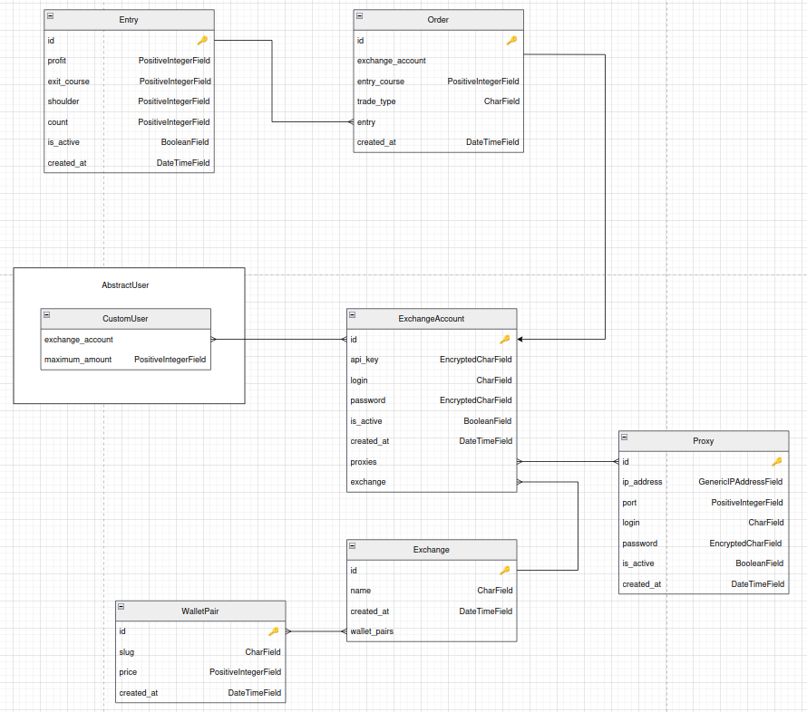

# multytrader

не забыть для мекса
sudo apt install protobuf-compiler

Решение проблемы:

    Обновите protoc до версии 3.20.0 или выше:
    bash

# Для Linux (x86_64)
PB_REL="https://github.com/protocolbuffers/protobuf/releases"
curl -LO $PB_REL/download/v25.2/protoc-25.2-linux-x86_64.zip
unzip protoc-25.2-linux-x86_64.zip -d ~/.local
export PATH="$PATH:~/.local/bin"

Установите правильную версию Python-библиотеки protobuf:
bash

pip install protobuf==3.20.3

Перегенерируйте .py файлы:
bash

    cd /home/ubwork/git/websocket-proto
    protoc --experimental_allow_proto3_optional --python_out=. *.proto

    Проверьте зависимости импортов:
    Убедитесь, что все сгенерированные *_pb2.py файлы находятся в одной директории с вашим скриптом и правильно импортируются друг другом.

Альтернативные решения:

    Если не можете обновить protoc:
    bash

pip install protobuf==3.20.3

Или установите переменную окружения (менее рекомендуемый способ):
bash

    export PROTOCOL_BUFFERS_PYTHON_IMPLEMENTATION=python

Важные замечания:

    Все .proto файлы должны компилироваться вместе одной командой, так как они могут зависеть друг от друга.

    Убедитесь, что используете одинаковые версии:

        protoc --version и pip show protobuf должны показывать совместимые версии (например, 3.20.x)

    После генерации новых *_pb2.py файлов перезапустите ваш Python-скрипт.

Если проблема сохраняется, попробуйте удалить все *_pb2.py файлы и сгенерировать их заново одной командой.

Не забыть переподключаться к мексу каждый 24 часа

УСТАНОВКА ЛИБЫ ПО МЕКСУ
1. Клонируй репозиторий и используй готовый SDK
bash

# Клонируй репозиторий
git clone https://github.com/mxcdevelop/mexc-api-sdk.git

# Перейди в папку с Python SDK
cd mexc-api-sdk/dist/python

# Распакуй архив (если есть архив)
# Если там файл .zip, то:
unzip mexc-python-sdk.zip

# Или если там .tar.gz:
tar -xzf mexc-python-sdk.tar.gz

# Перейди в распакованную директорию
cd mexc-python-sdk

# Установи SDK
pip install .

2. Или просто скопируй файлы в свой проект
bash

# Скопируй нужные файлы прямо в твой проект
cp -r mexc-api-sdk/dist/python/mexc-python-sdk/* /home/ubwork/git/multytrader/multy_trader/

3. Альтернативно - используй прямо из папки

Добавь путь к SDK в твой скрипт:
python

import sys
import os

# Добавь путь к распакованному SDK
sys.path.insert(0, '/home/ubwork/mexc-api-sdk/dist/python/mexc-python-sdk')

from mexc_sdk import Spot

# Остальной код...

4. Или просто скачай готовый wheel файл

Посмотри в папке dist/python - там должен быть файл .whl:
bash

# Установи напрямую из wheel файла
pip install /path/to/mexc_sdk-0.0.1-py3-none-any.whl